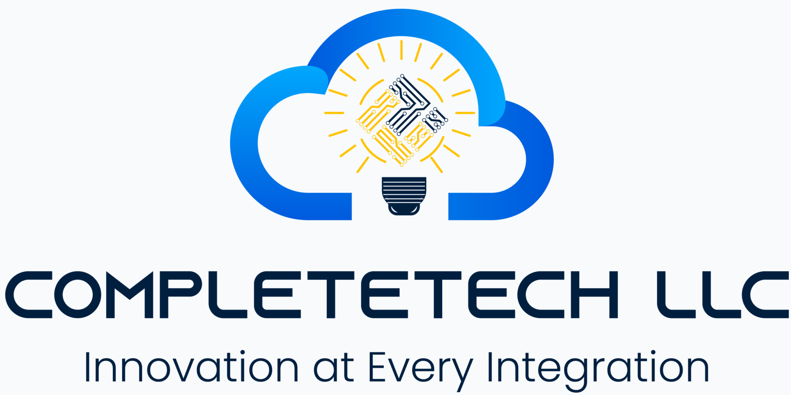

# Start here: org-comms-export

<p align="center"></p>

**CompleteTech LLC Skills** — Communications evidence and time accounting.

[Overview](README.md) · [Agent instructions](SKILL.md) · [Branding and handoffs](BRANDING.md) · [Contributing](CONTRIBUTING.md)

## 1. Choose the right skill

Use this skill to gather one organization's Outlook mail, Teams chats and calendar meetings, document them in a workbook with your own billing rules, and render a report. Its activation/install-directory key is **`org-comms-export`**; the repository is `org-comms-export-skill`. Install the whole skill directory, not only SKILL.md. Each agent product has its own discovery directory; use that product's documented installation mechanism.

## 2. Prepare a full checkout

Python 3.12 is the shared CI baseline.

```bash
git clone https://github.com/CompleteTech-LLC/org-comms-export-skill.git org-comms-export
cd org-comms-export
python3 -m venv .venv
. .venv/bin/activate
pip install -r requirements.txt
python scripts/validate_package.py
```

On Windows PowerShell, create the environment with `py -3 -m venv .venv` and use `.\.venv\Scripts\python.exe` instead of `python`; activation is optional. Do not change machine execution policy. A text-only registry package can omit binary logos and previews; these checkout checks require the full GitHub sources.

## 3. Run the fixture demonstration

```bash
python tests/make_fixtures.py
```

It should print `ALL OK`. The fixture is a fictional organization and synthetic people; it writes under `tests/out/` and touches no mailbox, chat or calendar. It builds a tree, two workbooks (neutral and CompleteTech branding) and two reports, and checks redaction, billing parameters, the held-meeting rule and branding. Open the files under `tests/out/` and inspect the layout.

## 4. Start a real export separately

Before the first collection, relay the **Before You Start** table in [SKILL.md](SKILL.md). Confirm which organization, which period and time zone, which chats belong to it, your billing rules and which identity (brand) the output should carry. Then follow the workflow in SKILL.md. The scripts read only what you point them at; the browser collectors read your own signed-in Outlook, Teams and calendar pages.

Real exports contain client names, activity and sometimes credentials. Keep trees, workbooks and reports out of Git (the repository's `.gitignore` excludes the usual names), do not share them without review, and rotate any credential the redaction report mentions.

## Branding and downstream use

Output is neutral unless an approved identity is selected. Set `branding.preset` to `completetech` in `config.json` for authorized CompleteTech output, or give your own name, tagline, accent, footer and local logo. Follow [BRANDING.md](BRANDING.md). Do not synthesize logos, fetch fonts or move brand assets between repositories. When handing hours to a billing skill, carry the evidence, the parameters used and the cases awaiting the operator's decision; an estimate is not an invoice.

## Safety, network and troubleshooting

Treat config files as trusted operator-controlled input. The scripts make no network calls. If `build_report.py` says the workbook has no cached values, recalculate it first (`scripts/recalc_excel.ps1` with desktop Excel, or LibreOffice). If a logo is not embedded, install Pillow. Missing assets usually indicate a partial checkout or the wrong working directory: run from the repository root.

## Verify changes

```bash
python -m unittest discover -s tests -p 'test_package_*.py' -v
python scripts/validate_package.py
python tests/make_fixtures.py
python scripts/validate_quality.py
```

Package tests are structural. Neither structural checks nor a successful render certify complete source coverage, billing facts or permission to share data; review the actual output. Follow [CONTRIBUTING.md](CONTRIBUTING.md).
