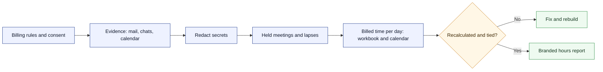
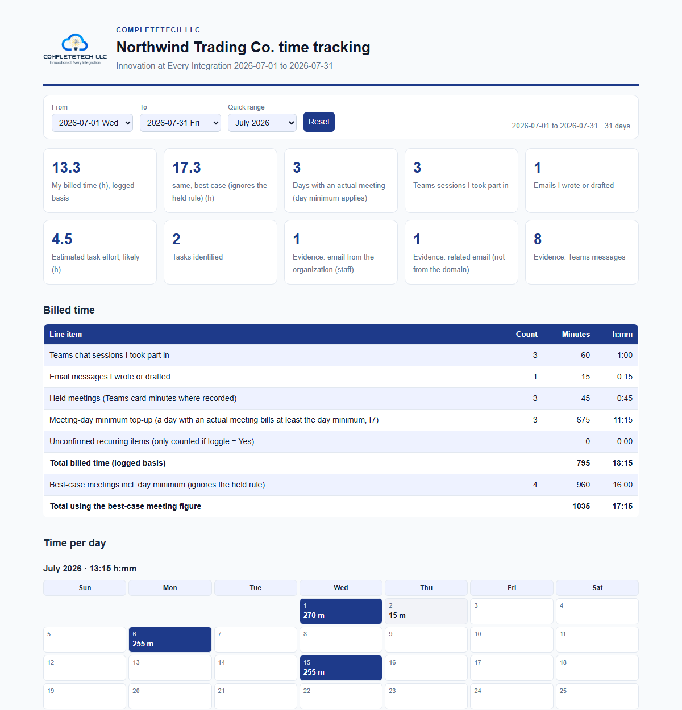

**CompleteTech LLC Skills** · [Start here](ONBOARDING.md) · [Agent instructions](SKILL.md) · [Branding](BRANDING.md) · [Skill library](https://github.com/CompleteTech-LLC/agentic-services-orchestrator-skill/blob/main/references/skill-family.md) · [Contributing](CONTRIBUTING.md)

# Org Time Tracking Skill

<p align="center">
  
</p>

A CompleteTech LLC skill for tracking time spent with one organization. It turns the evidence in your Outlook mail, Teams chats and calendar into billable hours under your own rules, shows them per day on a calendar with clickable event detail, and keeps a redacted evidence tree and a branded HTML report behind them.

## About

Part of the CompleteTech LLC skill library. It reads the operator's own signed-in Microsoft 365 web session through a browser and answers one question: how much time was spent, on which days, and what is the evidence? Time is billed under the operator's own rules: a minimum per lapse, a billing increment, a meeting-day minimum and a held-meeting rule (a scheduled call counts only if there was Teams conversation that day). Every organization, person, date, rule and brand value is a parameter; identity is neutral unless an approved one is chosen.

## OpenClaw / ClawHub Metadata

- Skill key: `org-time-tracking`
- Version-ready metadata: `1.0.0`
- Homepage: https://github.com/CompleteTech-LLC/org-time-tracking-skill
- README: https://github.com/CompleteTech-LLC/org-time-tracking-skill#readme
- Runtime binaries: `python3`
- Python packages: `openpyxl==3.1.5`, `pyyaml==6.0.3` (optional logo embedding: `pillow==12.2.0`)
- Windows only, optional: desktop Excel for `scripts/recalc_excel.ps1`
- License: repository code, templates, and documentation use MIT; brand assets are reserved, see `BRAND_ASSETS.md`.

## Workflow Diagram

Source: [assets/diagrams/workflow.mmd](assets/diagrams/workflow.mmd).



## What It Does

| Capability | Details |
|---|---|
| Time accounting | Teams sessions, emails written and meetings become lapses billed with a minimum, a rounding increment and a meeting-day minimum, all set by parameters; totals are formulas. |
| Daily view | Daily Time, a month-grid Calendar View and a Day Detail list: every minute traces to an event with a clickable source. |
| Held meetings | Calendar plus Teams meeting cards; a call counts as held only when there was Teams conversation that day (the rule is a parameter), and borderline cases are listed for the operator. |
| Effort estimates | Tasks with low/high/likely hours, marked as estimates and as requested or suggested. |
| Evidence | Outlook search results, Teams messages and calendar events collected through small parameterized browser scripts into a redacted `staff/`, `related/`, `alerts/`, `teams/`, `meetings/` tree by `YYYY-MM/DD.md`. |
| Report | One self-contained HTML file with hours first, brand tokens in light and dark, a monthly heat calendar, meetings and tasks, and From / To dropdowns (plus a quick month picker) that recompute every figure for the chosen range in the browser; `?from=YYYY-MM-DD&to=YYYY-MM-DD` preselects a range. |
| Branding | Neutral by default; the CompleteTech preset or the operator's own identity on request. |

## Contents

- `SKILL.md` - operating instructions, consent table and the parameter table (time tracking first, evidence second).
- `references/` - browser mechanics, meeting and billing semantics, workbook and report reference.
- `scripts/` - `build_tree.py`, `make_workbook.py`, `build_report.py`, `branding.py`, browser collectors (`*.js`), `recalc_excel.ps1`, validators.
- `templates/` - `config.example.json`, `meetings.example.json`, `tasks.example.json`, `branding.neutral.json`, `branding.completetech.json`.
- `examples/` and `tests/` - synthetic fixtures and the end-to-end suite.

## Quick Start

```bash
pip install -r requirements.txt
python3 tests/make_fixtures.py          # synthetic end-to-end run, prints ALL OK
python3 scripts/build_tree.py --in lines.txt --out ./acme --start 2026-07-01 --tz "America/New_York"   # evidence tree
python3 scripts/make_workbook.py --config config.json
python3 scripts/build_report.py --config config.json --theme auto
```

Copy `templates/*.example.json` to `config.json`, `meetings.json` and `tasks.json` and edit them; nothing is read from the repository's own examples at run time. The workbook has no cached values until Excel or LibreOffice recalculates it; the report needs those values.

## Example



Rendered from the synthetic Northwind fixture with the CompleteTech preset: [report](assets/examples/example.html) (light and dark, follows the reader's system) and [workbook](assets/examples/example.xlsx). The fixture data is fictional. Regenerate with `python tests/make_examples.py` (Windows with desktop Excel).

## Runtime Permissions

| Area | Runtime behavior |
|---|---|
| Execution | Local Python entry points and, optionally, a PowerShell script that drives desktop Excel; browser collectors run inside the operator's own tab. |
| Reads | The operator's signed-in Outlook, Teams and calendar pages; the tree, config files and the local logo. |
| Writes | Only the operator-chosen tree, workbook and report paths. |
| Network | None from the scripts. The browser session reads Microsoft 365 as the operator would. |

| Not Included | Boundary |
|---|---|
| Mailbox changes | Never sends, deletes, moves or edits mail, chats or events. |
| Credentials | Never stores or prints passwords, tokens or keys; redacts those found in chats. |
| Billing | Does not invoice or authorize billing; estimates are evidence for the operator's own decision. |
| System changes | No persistence, no scheduled tasks, no privilege escalation. |

## License

Code, templates, and documentation are licensed under the MIT License. CompleteTech LLC names, logos, seals, and brand assets are reserved and are not licensed for reuse except to identify this project. See `LICENSE` and `BRAND_ASSETS.md`.
